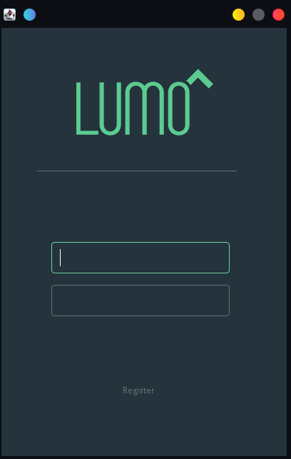

# A Simple Client Based on Swing GUI

## 描述

我基于[LoginGUI](https://github.com/ProductOfAmerica/LoginGUI)创建了一个简单的swing Client, 用于测试我的 [简单服务端](https://github.com/CtrlZ233/MyServer).

## Examples:
**Screenshot:**

## What's New:
1. 新增注册界面。
2. 新增与服务端的连接管理。
3. 新增消息分发处理。
4. 新增消息编解码。
